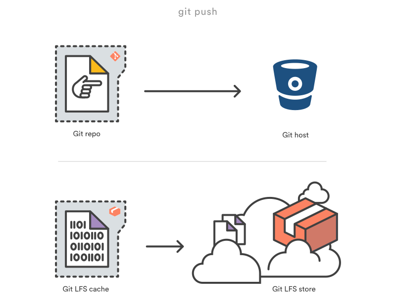

# Push and pull GitHub projects containing large-size files with Git Large File Storage (LFS)

As we know, Github does not support uploading and managing files larger than 100MB by default. If your project contains large files, you may check out Git LFS. Using this tool, you can manage/upload & control your project/repo having sizes larger than 100MB. Note that tha maximum repository size is 10GB for free tier. If you want to increase the size further, Github provides organizational level grants where it's a pay as you scale model.

## What is Git LFS
Git is a **distributed version** control system, meaning the entire history of the repository is transferred to the client during the cloning process. For projects containing large files, particularly large files that are modified regularly, this initial clone can take a huge amount of time, as every version of every file has to be downloaded by the client. Git LFS (Large File Storage) is a Git extension to reduce the impact of large files in your repository by downloading the relevant versions of them *lazily*. Specifically, large files are downloaded during the checkout process rather than during cloning or fetching.

Git LFS does this by replacing large files in your repository with tiny pointer files. During normal usage, you'll never see these pointer files as they are handled automatically by Git LFS:

When you add a file to your repository, Git LFS replaces its contents with a pointer, and stores the file contents in a local Git LFS cache. 

When you push new commits to the server, any Git LFS files referenced by the newly pushed commits are transferred from your local Git LFS cache to the remote Git LFS store tied to your Git repository. 

When you checkout a commit that contains Git LFS pointers, they are replaced with files from your local Git LFS cache, or downloaded from the remote Git LFS store.

For more information, please refer to this [tutorial](https://www.atlassian.com/git/tutorials/git-lfs)
## Installation of Git LFS
* Windows
  * Download and install from the [Git LFS binary execution file](https://git-lfs.github.com/)
* Ubuntu
  * Install `curl`

        sudo apt install curl

  * Request Git LFS

        curl -s https://packagecloud.io/install/repositories/github/git-lfs/script.deb.sh | sudo bash

  * Install Git LFS

        sudo apt install git-lfs

## Configuration of Git LFS
Run `git lfs install` once. After configuration of Git LFS, you may execute `git lfs version` in terminal to check the version of Git LFS

## Upload project files to GitHub
In project files of this repo, `ads-50k.json`(146MB) is a large file whose size is beyond the limitation of 100MB. You may follow the below steps to upload the large files to GitHub.

1. Create a new repo on GitHub
2. Open the Git Bash terminal, change your current working directory to your project directory that you want to work with Git LFS
3.  Initialize the local repo, and track large files with `git lfs track` followed by the file names (or the file extension) you want to automatically upload to Git LFS.

        git init
        git lfs track "ads-50k.json"

    Every large files you want to associate with Git LFS will need to be added with `git lfs track`. This command amends a ***.gitattributes*** file to your repository and associates large files with Git LFS.

4.  Add *.gitattributes* file to local stage area

         git add .gitattributes

5.  Add the remaining files to local repo and tag the current branch

        git add --all
        git commit -m "first commit"
        git branch -M main

6.  Configure the remote repo and push local repo to GitHub

        git remote add origin https://github.com/your_username/your_repo.git
        git push origin main

## Pull project files from GitHub
Just clone the project files from GitHub

    git clone https://github.com/your_username/your_repo

If you execute `git clone` before the installation of Git LFS, it only pulls the pointers to the large files. To pull the complete large files, you need to run

    git lfs pull

## Possible issues
Free accounts of Git LFS have a total of 1GB storage space and 1GB downloading bandwidth per month. You may fail to clone the project files and see the following error, if you run out of your free monthly quota.

    Downloading rosdistro.tar.gz (105 MB)
    Error downloading object: rosdistro.tar.gz (2dffd34):
    Smudge error: Error downloading rosdistro.tar.gz (2dffd34dccb171115c2fcd4326735780181e0705bba57d502d3bf85538f92740):
    batch response: This repository is over its data quota.
    Account responsible for LFS bandwidth should purchase more data packs to restore access.

    Errors logged to /home/shipeng/rostaller/.git/lfs/logs/20210706T224710.870367616.log
    Use `git lfs logs last` to view the log.
    error: external filter 'git-lfs filter-process' failed
    fatal: rosdistro.tar.gz: smudge filter lfs failed
    warning: Clone succeeded, but checkout failed.
    You can inspect what was checked out with 'git status'
    and retry the checkout with 'git checkout -f HEAD'

You have to subscribe extra data package to continue the downloading.